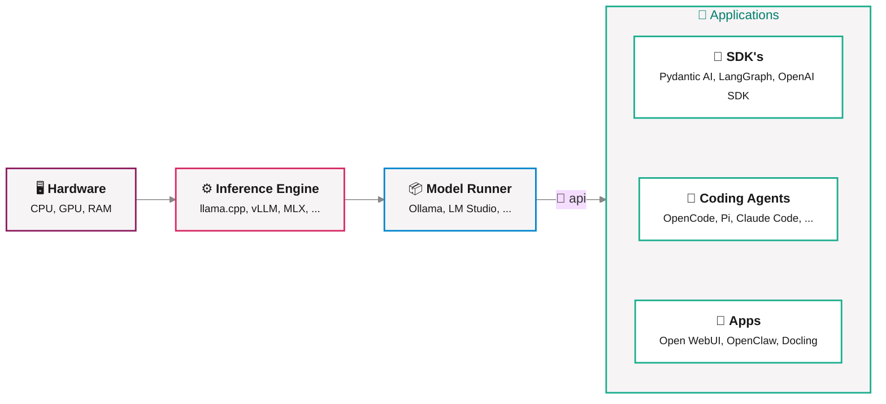

# Ingredients

Source of `ingredients.svg` – rebuild with `make diagram`.

```mermaid
%%{init: {"theme": "base", "fontFamily": "Arial, Helvetica, sans-serif", "themeVariables": {"fontFamily": "Arial, Helvetica, sans-serif", "lineColor": "#878786"}}}%%
flowchart LR
    HW["🖥️ <b>Hardware</b><br/><small>CPU, GPU, RAM</small>"]
    IE["⚙️ <b>Inference Engine</b><br/><small>llama.cpp, vLLM, MLX, ...</small>"]
    MR["📦 <b>Model Runner</b><br/><small>Ollama, LM Studio, ...</small>"]

    subgraph APPS["🧩 Applications"]
        direction TB
        SDK["🐍 <b>SDK's</b><br/><small>Pydantic AI, LangGraph, OpenAI SDK</small>"]
        CA["🤖 <b>Coding Agents</b><br/><small>OpenCode, Pi, Claude Code, ...</small>"]
        APP["💬 <b>Apps</b><br/><small>Open WebUI, OpenClaw, Docling</small>"]
        %% invisible links stack the three boxes vertically
        SDK ~~~ CA ~~~ APP
    end

    HW --> IE --> MR -- "🔌 api" --> APPS

    classDef hw fill:#f7f4f6,stroke:#8c195f,stroke-width:2px,color:#191919
    classDef engine fill:#f7f4f6,stroke:#d72864,stroke-width:2px,color:#191919
    classDef runner fill:#f7f4f6,stroke:#0085cd,stroke-width:2px,color:#191919
    classDef app fill:#ffffff,stroke:#1cae8d,stroke-width:2px,color:#191919
    class HW hw
    class IE engine
    class MR runner
    class SDK,CA,APP app
    style APPS fill:#f7f4f6,stroke:#1cae8d,stroke-width:2px,color:#007e6b
```
